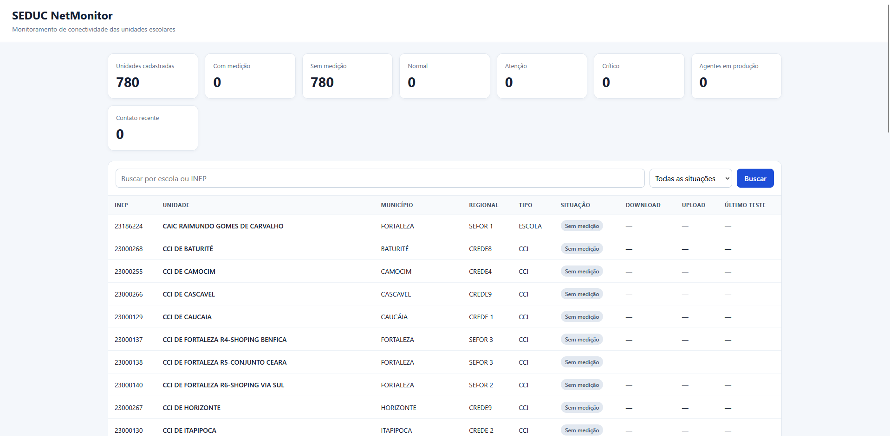

# SEDUC NetMonitor

Plataforma de monitoramento de conectividade das unidades escolares da SEDUC.

## Estado atual

Documentação consolidada em **26/09/2026**.

Já implementado:

- API FastAPI;
- PostgreSQL 17;
- agente Linux homologado na versão **0.6.2**;
- enriquecimento ASN;
- dashboard interno com BFF;
- publicação interna via Caddy;
- DNS interno via AdGuard Home;
- paginação, busca, filtros e detalhe por unidade;
- download, upload e último teste diretamente na tabela;
- separação entre produção e homologação.

## Princípios

1. Oracle é usada para control plane/publicação/roteamento, não como servidor de medição de velocidade.
2. O Speedtest usa seleção automática/default de servidor.
3. Workloads mais pesados ficam no HOME-01.
4. O browser nunca recebe `X-NetMonitor-Internal-Secret`.
5. O dashboard usa BFF server-side.
6. O dashboard não publica porta no host.
7. Homologação não entra nos indicadores de produção.
8. Velocidade contratada é tratada como simétrica salvo upload explicitamente informado.

## Documentação

- `docs/architecture.md`
- `docs/database.md`
- `docs/api.md`
- `docs/agent.md`
- `docs/dashboard.md`
- `docs/dns-and-proxy.md`
- `docs/security.md`
- `docs/operations.md`
- `docs/status-2026-09-26.md`
- `docs/adr/`
- `CHANGELOG.md`

## Segurança

Nunca versionar tokens, senhas, secrets, chaves privadas ou `.env` real.

## Screenshot atual

